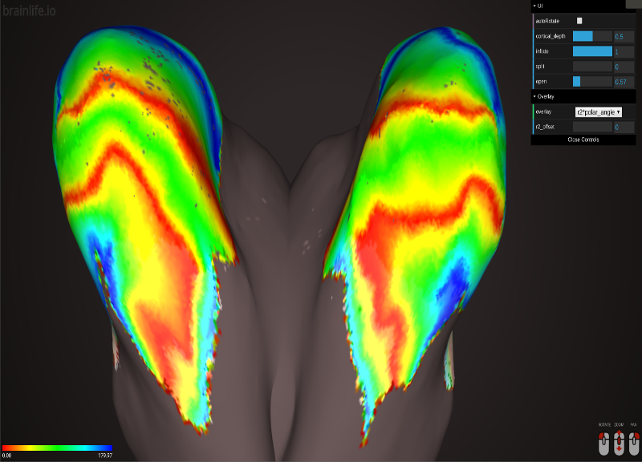

# Map pRFs in visual cortex with anatomy

Brainlife.io app for Noah Benson's neuropythy library, retinotopy from T1 anatomy.

For additional documentation, in particular usage documentation, see the neuropythy wiki and the OSF wiki for Benson and Winawer, (2018).

# Write me..
