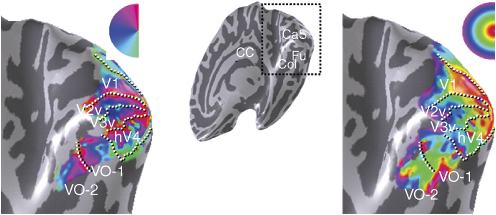

[](https://github.com/brain-life/abcd-spec)

# Map pRFs in visual cortex with anatomy

This app performs a retinotopic mapping in visual areas V1, V2, and V3, as well as higher-order visual areas, from an anatomical (T1-weighted MRI) image, using the neuropythy python library by Noah Benson (github.com/noahbenson/neuropythy).

An group-derived, anatomically-defined template is fit to the subject's T1 anatomy, while correcting for distortions caused by cortical folding, to provide retinotopic maps in V1, V2, and V3, as well as mapping further visual areas included in key.txt. The measures are outputted in the brain volume (.nii.gz) as well as on the cortical surface (freesurfer .curv format as well as .gii.gz format).

pRF measures include:
  polar angle: the location of the receptive field in polar coordinates (from the upper vertical meridian at 0° to the lower vertical meridian at 90°)
  eccentricity: the deviation of the center of the receptive field from the fovea (in degrees)
  receptive field width: the size of the voxel's receptive field (the standard deviation of the receptive field's 2d isotropic Gaussian)
  visual area: the voxel's predicted visual area (1-12, key found in ./varea/key.txt)


Shows maps in several visual areas of polar angle, left, and eccentricity, right


Visualized on Brainlife

### Authors
- [David Hunt](davhunt@iu.edu)
- [Noah Benson](nben@nyu.edu)

### Project director
- Franco Pestilli (franpest@indiana.edu)

## Running the App 

### On Brainlife.io

You can submit this App online at [https://doi.org/10.25663/brainlife.app.187](https://doi.org/10.25663/brainlife.app.187) via the "Execute" tab.

### Running Locally (on your machine)

1. git clone this repo.
2. Inside the cloned directory, create `config.json` with something like the following content with path to your freesurfer subject directory.

```json
{
        "freesurfer": "./freesurfer/subjects/bert"
}
```

3. Launch the App by executing `main`

```bash
./main
```

### Sample Datasets

If you don't have your own freesurfer subject, you can download sample datasets from Brainlife.io, or you can use [Brainlife CLI](https://github.com/brain-life/cli).

```
npm install -g brainlife
bl login
mkdir input
bl dataset download 598a2aa44258600aa3128fd4 && mv -R 598a2aa44258600aa3128fd4 input/output
```

## Output

All output files will be generated under the current working directory (pwd). The main output of this App is the directory `prf`, which contains the population receptive field measures polarAngle, eccentricity, rfWidth, and varea in the brain volume (*.nii.gz) as well as on the cortical surface (lh.polarAngle, etc) in freesurfer .curv format and gifti format.

```
    .
    ├── prf                     # Contains all pRF measures
    │   ├── polarAngle.nii.gz
    │   ├── eccentricity.nii.gz
    │   ├── rfWidth.nii.gz
    │   ├── varea.nii.gz
    │   ├── surfaces            # White, pial, inflated, and sphere surfaces in .vtk
    │   │   ├── lh.white.vtk
    │   │   ├── rh.white.vtk
    │   │   ├── ...
    │   ├── prf_surfaces        # pRF measures projected onto .vtk surfaces
    │   │   ├── lh.polarAngle
    │   │   ├── rh.polarAngle
    │   │   ├── ...
    ├── varea                   # Volumetric parcellation of brain into visual areas
    │   ├── key.txt
    │   ├── label.json
    │   ├── parc.nii.gz
    ├── varea_surf              # Surface/cortical parcellation into visual areas
    │   ├── key.txt
    │   ├── label.json
    │   ├── lh.parc.annot.gii
    └   └── rh.parc.annot.gii
```

### Dependencies

This App only requires [singularity](https://www.sylabs.io/singularity/) to run.

### References

[Benson et al, 2012. The retinotopic organization of striate cortex is well predicted by surface topology](https://doi.org/10.1016/j.cub.2012.09.014)

[Benson et al, 2014. Correction of distortion in flattened representations of the cortical surface allows prediction of V1-V3 functional organization from anatomy](10.1371/journal.pcbi.1003538)
